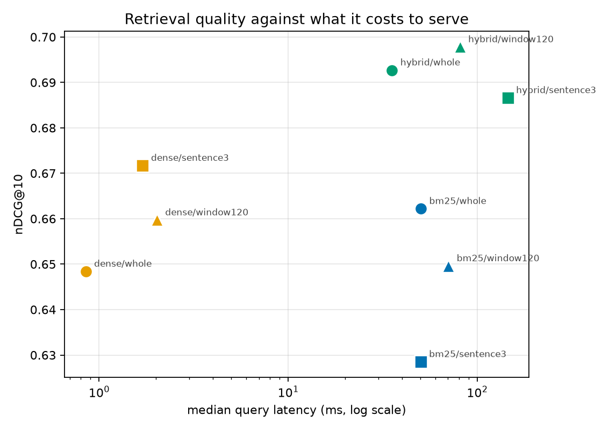
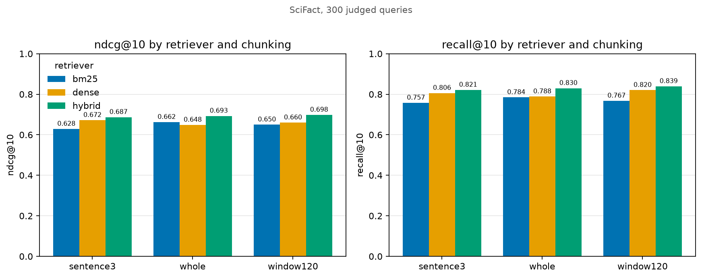
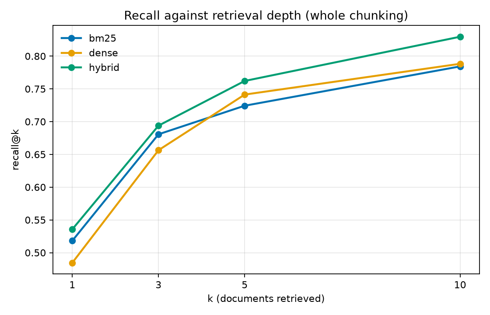

# rag-eval-lab

A retrieval-augmented search system, and the harness that measures how well it
actually retrieves.

Most RAG demos show you an answer. This one shows you **recall@10, nDCG@10 and p95
latency for nine configurations**, so the choice of retriever and chunking strategy
is an argument from evidence rather than a default nobody revisited.

Evaluated on [SciFact](https://github.com/allenai/scifact): 5,183 scientific
abstracts, 300 test claims, with relevance judgments made by human annotators —
not by me, which is the point.



---

## Results

All nine configurations, 300 judged queries, measured on 8 CPU cores.

| Chunking | Retriever | Chunks | nDCG@10 | Recall@10 | MRR@10 | p50 ms | p95 ms |
|---|---|---:|---:|---:|---:|---:|---:|
| whole | bm25 | 5,183 | 0.6622 | 0.7843 | 0.6302 | 50.3 | 128.6 |
| whole | dense | 5,183 | 0.6484 | 0.7883 | 0.6068 | **0.9** | **1.3** |
| whole | **hybrid** | 5,183 | 0.6927 | 0.8296 | 0.6544 | 35.4 | 72.2 |
| sentence3 | bm25 | 16,626 | 0.6285 | 0.7573 | 0.5948 | 50.2 | 114.5 |
| sentence3 | dense | 16,626 | 0.6717 | 0.8057 | 0.6335 | 1.7 | 4.9 |
| sentence3 | hybrid | 16,626 | 0.6866 | 0.8211 | 0.6494 | 145.0 | 322.3 |
| window120 | bm25 | 13,030 | 0.6496 | 0.7673 | 0.6189 | 70.4 | 177.0 |
| window120 | dense | 13,030 | 0.6597 | 0.8200 | 0.6124 | 2.0 | 2.9 |
| window120 | **hybrid** | 13,030 | **0.6978** | **0.8389** | **0.6592** | 81.0 | 216.2 |

Reproduce with `python -m rageval.evaluate` (about 40 minutes cold on CPU, seconds
once embeddings are cached).

**Quality figures are deterministic** — every one of them reproduced bit-identically
on a second independent run. **Latency figures are not**, swinging by up to 2.5x
depending on what else the machine is doing. See
[`results/latency_variance.md`](results/latency_variance.md) for both runs side by
side. Treat the latency column as directional, not as a measurement.

---

## What the numbers say

### 1. Hybrid retrieval beats both of its parts, every time

In all three chunking strategies, reciprocal rank fusion scores higher than either
BM25 or dense alone. At `whole` chunking it reaches nDCG@10 0.6927 against 0.6622
for BM25 and 0.6484 for dense — **4.6% and 6.8% relative improvement** over
components that individually look fairly similar.

That is the useful part: the two retrievers fail on *different* queries. BM25
matches exact terminology, which matters enormously in scientific text where
"myocardial infarction" is not a paraphrase of "heart attack". Dense retrieval
matches meaning when the wording differs. Fusing by rank rather than by score
avoids having to reconcile BM25's unbounded scores with cosine similarities in
[-1, 1] — the step where naive hybrids usually break.

### 2. Chunking helps dense retrieval and *hurts* BM25

This was the result I did not expect, and it is the most interesting thing here.

| | whole | sentence3 | change |
|---|---:|---:|---|
| dense nDCG@10 | 0.6484 | 0.6717 | **+3.6%** |
| bm25 nDCG@10 | 0.6622 | 0.6285 | **−5.1%** |

The two retrievers respond to chunking in opposite directions, so "what is the best
chunk size?" has no answer independent of what you retrieve with.

The mechanism is that BM25 is built on **document-level statistics**. Splitting one
abstract into four chunks fragments its term frequencies — a term appearing three
times in an abstract may now appear once in each of three chunks, and BM25's
saturation curve treats that very differently. It also drops the average document
length, so the `b` length-normalisation term is now calibrated against a corpus
that no longer exists. Dense retrieval has no such dependency: a shorter passage
simply produces a less diluted embedding, so the vector represents one idea rather
than averaging five.

**Practical implication:** if you are running hybrid retrieval, chunking tuned on
dense metrics alone will quietly degrade your lexical half.

### 3. The best-scoring configuration is not the one to ship

`hybrid/window120` tops the table at nDCG@10 0.6978. `hybrid/whole` scores 0.6927.

The gap is **0.0051, or 0.7% relative** — and across 300 queries that is inside the
noise. It is not a difference I would defend.

What it costs is not inside the noise:

- **2.5x the index** — 13,030 chunks against 5,183. This one is deterministic: 2.5x
  the vectors to store, 2.5x the memory resident, and 2.5x the embedding compute on
  every rebuild.
- **Consistently higher query latency.** Across two runs, `hybrid/whole` measured
  35-54 ms at p50 and `hybrid/window120` measured 69-81 ms. The ordering held both
  times; the ratio ranged from 1.3x to 2.3x, which is why the argument above rests
  on index size instead.

So: 2.5x the storage and compute, reliably slower queries, for 0.7% nDCG that
300 queries cannot separate from noise. I would ship `hybrid/whole`.

This is the reason the table reports cost next to quality. A leaderboard column
alone would have chosen the worse system, and chosen it confidently.

### 4. Dense retrieval is ~55x faster here, but read the caveat

Dense search runs at 0.9 ms p50 against 50.3 ms for BM25, and that ratio was the
most stable measurement in the whole harness — dense moved only from 0.85 to 0.91 ms
between runs, because it is a single FAISS call rather than a Python loop.

**The comparison is not language-fair.** FAISS is optimised C++; my BM25 is pure
Python walking posting lists. A production BM25 in Lucene or Tantivy would be within
a small factor of FAISS, not 55x behind.

What the number *does* honestly show is the cost of the naive implementation most
people reach for first — and it explains why `hybrid` is slower than `dense`: fusion
pays the BM25 cost plus the dense cost.

---





Recall@1 is 0.54 and recall@10 is 0.83 for the best configuration. In RAG terms
that is the real constraint: if you pass only the top 3 chunks into the context
window you are working with recall@3 of 0.70, so **three queries in ten cannot be
answered correctly no matter how good the generator is**. Retrieval sets the
ceiling; the language model can only lower it.

---

## How it works

```
documents ──► chunking ──┬──► embeddings ──► FAISS index ──► dense
                         │                                     │
                         └──► token postings ──► BM25 ─────────┤
                                                                ▼
                                                    reciprocal rank fusion
                                                                │
                                                    chunk scores │ max-pooled
                                                                 ▼
                                                          ranked documents
```

**Chunk-level retrieval, document-level scoring.** A document's score is the best
score among its chunks. Summing would reward long documents for merely having more
chunks. Getting this mapping wrong is the most common way a chunked retriever loses
recall it appears to have.

**Over-fetching.** Retrieving exactly *k* chunks can yield far fewer than *k*
documents when several chunks of one document occupy the top ranks, so the dense
retriever fetches 8× and the fusion 4× before pooling.

| Component | Choice | Why |
|---|---|---|
| Embeddings | `all-MiniLM-L6-v2` | 384-dim, runs on CPU, no API key |
| Vector index | FAISS `IndexFlatIP` | exact search; ANN adds recall loss to measure at 5k docs |
| Lexical | BM25 (k1=1.2, b=0.75) | written from scratch; defaults untuned |
| Fusion | RRF (k=60) | combines ranks, not incomparable score scales |

BM25 and RRF parameters were **not tuned on the test queries.** Tuning them and
reporting the result would inflate every number in the table.

---

## Running it

```bash
pip install -r requirements.txt
python scripts/download_data.py --dataset scifact
export PYTHONPATH=src

python -m rageval.evaluate        # full sweep -> results/
python scripts/make_figures.py    # figures/
pytest -q                         # 25 tests, no corpus needed
```

Serve the API:

```bash
docker compose up
curl -X POST localhost:8000/search \
  -H 'Content-Type: application/json' \
  -d '{"query": "Does vitamin D reduce respiratory infection?", "top_k": 5}'
```

No API keys anywhere. Retrieval evaluation runs entirely on local models, so
anyone can reproduce the table above rather than taking it on trust.

---

## Limitations

Stated plainly, because a benchmark whose author will not name its weaknesses is
not a benchmark.

- **One dataset, one domain.** SciFact is scientific abstracts, where exact
  terminology is unusually load-bearing. That plausibly flatters BM25 and the
  hybrid. Conclusions here should not be assumed to transfer to conversational or
  legal text without re-running the sweep.
- **Retrieval only.** No generation quality, faithfulness or hallucination
  measurement. The generator is pluggable but unevaluated — the harness answers
  "was the evidence retrieved?", not "was the answer right?".
- **One embedding model.** The chunking conclusions may be specific to MiniLM's
  256-token limit; a long-context embedder would likely narrow the gap.
- **Latency is single-process, unbatched, on one machine, and noisy.** Re-running
  the sweep moved individual p50 figures by up to 2.5x while every quality metric
  stayed bit-identical. The ordering is trustworthy; the magnitudes are not. Real
  benchmarking would pin cores and report a distribution over many repetitions.
  No concurrency, no cold-start, no network.
- **Exact search.** `IndexFlatIP` scans everything. At 5,183 documents that is
  correct; at ten million it is not, and HNSW or IVF would introduce a recall/speed
  trade-off this harness does not yet measure.
- **The sentence splitter is a regex.** It mis-splits on "et al." and on decimals,
  both common in scientific text, so `sentence3` is slightly penalised by
  tokenisation noise rather than by chunking as such.
- **300 queries is small.** Differences under roughly one point of nDCG are inside
  the noise, which is exactly why I would not pay 2.3× latency for 0.7%.

## Licence

MIT
